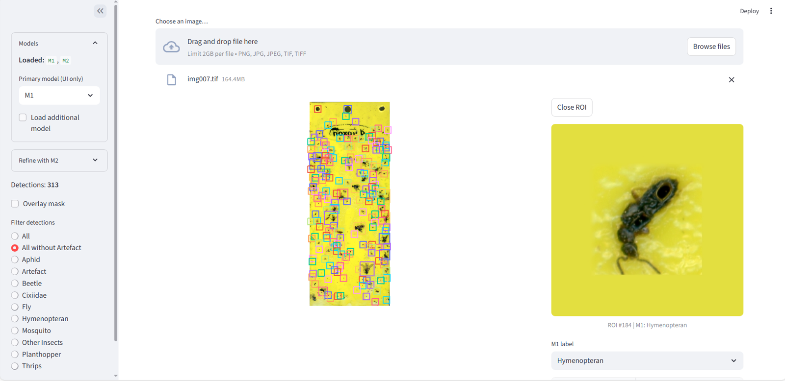
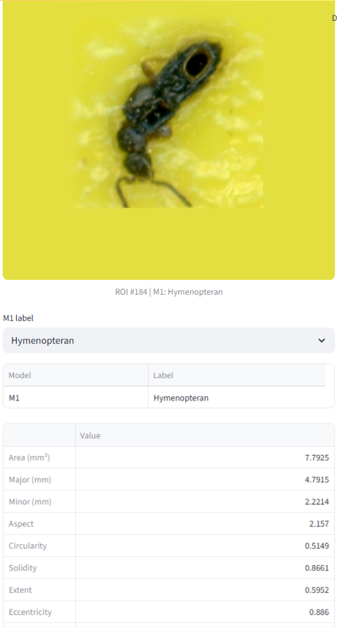
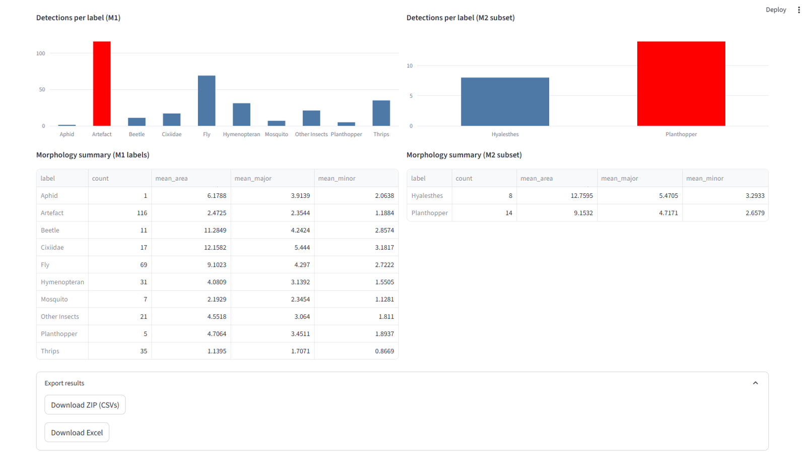

# Planthopper Detection & Analysis (Streamlit)

A fast, local web app to analyze sticky-trap images:

* 🔎 **Detect** insects and refine them into clean ROIs
* 🧠 **Classify** each ROI with a primary model (**M1**)
* 🧪 **Refine** “Cixiidae / Planthopper” ROIs with a secondary model (**M2**)
* ✏️ **Edit labels** per-ROI (M1 & M2) and see charts/summaries update live
* 📊 **Morphology** metrics per ROI (area, axes, solidity, circularity, …)
* 🗺️ **Overlay masks** and explore detections interactively
* ⬇️ **Export** per-image results to ZIP (CSVs) or Excel, reflecting any edits

Runs entirely on your machine (CPU or CUDA if available). No external services.

---

## Table of Contents

- [Demo](#demo)
- [Installation](#installation)
  - [Conda (recommended)](#conda-recommended)
  - [Pip](#pip)
- [Model Weights (`config.yaml`)](#model-weights-configyaml)
- [Quick Start](#quick-start)
- [Using the App](#using-the-app)
  - [1) Upload & detections](#1-upload--detections)
  - [2) Classify (M1) & refine (M2)](#2-classify-m1--refine-m2)
  - [3) Edit labels](#3-edit-labels)
  - [4) Filters, overlays & charts](#4-filters-overlays--charts)
  - [5) Export](#5-export)
- [How It Works](#how-it-works)
- [Performance Tips](#performance-tips)
- [FAQ](#faq)
<!-- - [License](#license) -->
<!-- - [Acknowledgments](#acknowledgments) -->
<!-- - [Citation](#citation) -->

---

## Demo


| Overview                                        | ROI view & label editor                   | Charts & summary                         |
| ----------------------------------------------- | ----------------------------------------- | ---------------------------------------- |
|  |  |  |

---

The app entrypoint is **`src/app.py`**.

---

## Installation
**Note:** Python **3.10** is recommended.  

### Conda (recommended)

```bash
# 1) Create & activate the environment (CUDA 12.1 by default)
conda env create -f environment.yaml
conda activate planthopper
```

CPU-only? Edit `environment.yaml` and comment out the `pytorch-cuda=12.1` line before creating the env.

### Pip

```bash
# CUDA 12.1 wheels (GPU); remove the first line in requirements.txt for CPU-only
python -m venv .venv
source .venv/bin/activate                    # (Windows: .venv\Scripts\activate)
pip install -r requirements.txt
```

---

## Model Weights (`config.yaml`)

Create **`config.yaml`** at the repo root with absolute paths to your checkpoint files which can be downloaded from the URL provided in the `ckpt_download.txt` file:

```yaml
M1_MODEL_PATH: "/abs/path/to/m1_checkpoint.pth"
M2_MODEL_PATH: "/abs/path/to/m2_checkpoint.pth"
```


## Quick Start

```bash
# (inside the conda/venv you created)
streamlit run src/app.py
```

Optional Streamlit defaults live in **`.streamlit/config.toml`** (e.g., upload size, theme). Example:

```toml
[server]
maxUploadSize = 2048
headless = true

[theme]
base = "light"
primaryColor = "#4E79A7"
```

---

## Using the App

### 1) Upload & detections

* Drop a trap image (`.jpg/.png/.tif`) into the uploader. Expected resolution of a trap is 1600 dpi.
* The app runs detection + ROI refinement then visualizes and quantifies detections within the dashboard.

### 2) Classify (M1) & refine (M2)

* **M1** runs on every ROI (multi-class).
* **M2** runs **only** on ROIs with M1 label in `{Cixiidae, Planthopper}` (sub-classifier with 4 labels).
  You can also:

  * Run M2 on newly-eligible ROIs from the **sidebar** (“Refine with M2”).
  * Run M2 for a **single ROI** in the right panel (button appears when eligible).

### 3) Edit labels

* Click a box on the main image to open its **ROI view** on the right.
* Use the dropdown(s) to change **M1** and/or **M2** labels.

  * If you change M1 *away* from `{Cixiidae, Planthopper}`, any M2 label for that ROI is automatically cleared to stay consistent.
  * If you change M1 *into* `{Cixiidae, Planthopper}`, you can run M2 for that ROI (button).
* All edits are stored per image and **immediately update** plots, summaries, and exports.

### 4) Filters, overlays & charts

* Sidebar:

  * **Overlay mask** toggle (applies to the zoomed ROI view).
  * **Filter detections**: “All”, “All without Artefact”, or a single label.
* Charts:

  * **M1 counts** (all ROIs).
  * **M2 counts** (subset refined by M2).
* **Morphology summary** tables recompute with your edited labels.

### 5) Export

* In the “Export results” expander:

  * **ZIP (CSVs)**: per-instance table, counts (M1/M2), morphology summaries.
  * **Excel**: the same data in multi-sheet `.xlsx`.
* Exports reflect **current** edited labels.

---

## How It Works

- **Detect candidates** (`detect_insect_candidates`)
  - Builds a foreground mask (inverted channel avg + Otsu), cleans with morphology, gets CCs.
  - Converts to **square** boxes (with min size/pad) and optionally merges overlaps.
  - Returns per-ROI crops and matching binary masks.

- **Prep ROIs** (`prep_roi_and_mask`)
  - Scales ROI+mask to a target DPI if provided, pads to square, resizes to the model’s `out_size`.
  - Produces model-ready inputs and display ROIs (384 px).

- **Classify**
  - **M1** runs on every ROI.
  - **M2** runs only when M1 ∈ `{Cixiidae, Planthopper}`; reuses M1-prepped inputs for M2.

- **Morphology** (`compute_morphology`)
  - From each ROI mask: area, major/minor axes, circularity, solidity, extent, eccentricity, orientation.
  - Converts to mm using `compute_mm_per_px(dpi)` when available; aggregates by current labels.

- **UI & exports**
  - Plotly boxes with hover text `M1` or `M1 (M2)`; click any box to open the ROI panel.
  - Editable **M1/M2** labels update counts, summaries, and hover text live.
  - Export ZIP (CSVs) or Excel—both reflect any manual edits.

---

## Performance Tips

* **GPU** is used automatically if available; otherwise falls back to CPU.
* Very large images are **downsampled** for display; computation still uses ROI crops.
* If you process many large images, consider closing other GPU apps and increasing Streamlit’s upload size (`.streamlit/config.toml`).

---

## FAQ

**Q: Can I use only M1?**
A: Yes. The app runs fine with M1 only. M2 is optional and only used to refine “Cixiidae / Planthopper”.

**Q: Will label edits persist across images?**
A: Edits are tracked per uploaded image in the app session. Exports include them.

**Q: Can I run this on CPU only?**
A: Yes. The app auto-detects CUDA; without it, it runs entirely on CPU (slower, but fine for moderate image sizes).

**Q: Where do I change eligible classes for M2?**
A: In `src/app.py`, the eligible set is `{ "Cixiidae", "Planthopper" }`. You can factor this into a constant if you want a single source of truth.

